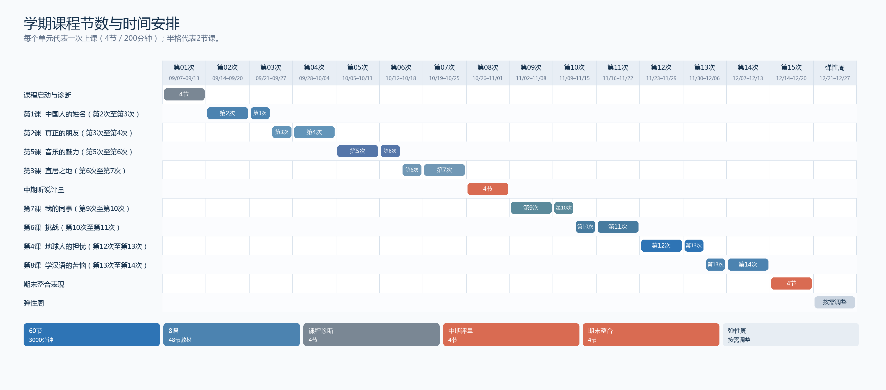

# 《博雅汉语听说：中级冲刺篇 I》整学期教师手册

    荣市大学华语听说课程 · 2026 年秋季学期

    ## 文件信息

    | 栏目 | 当前内容 |
    | --- | --- |
    | 文件版本 | v0.4 |
    | 当前范围 | 全学期课程总览＋第一课〈中国人的姓名〉 |
    | 后续扩充 | 第2–8课继续写入本手册，沿用同一课次结构 |
    | 课程状态 | 第一课教师手册已于 2026-08-20 由 Adam 批准；全学期日期按学校正式课表微调 |
    | 教师手册语言 | 简体中文；只有在确有需要时另附越南文说明 |
    | 学生端语言 | 全中文；目标内容使用教材简体字 |
    | 课程教材 | 《博雅汉语听说：中级冲刺篇 I》 |
    | 更新日期 | 2026-08-21 |

    ## 1. 课程快照

    | 项目 | 执行规格 |
    | --- | --- |
    | 学生起点 | 已完成《博雅汉语听说：初级起步篇》一、二册，进入中级冲刺阶段 |
    | 课程重点 | 听力理解、口语互动、成段口语表达；阅读只作为听说任务的输入和证据来源 |
| 课程方法 | ACTFL能力导向教学（PBI）；用理解、人际互动、表达呈现三种模式组织可观察表现 |
| 任务设计 | 使用真实角色、信息差、条件限制、共同产出和追问，形成行动导向任务 |
    | 学期时间 | 2026/09/07–2026/12/27；15次实际授课，保留第16周作为弹性周 |
    | 课堂单位 | 1节 = 50分钟；1次上课 = 4节 = 200分钟；1课 = 6节 = 300分钟 |
    | 学期总量 | 15次 × 4节 = 60节，共3000分钟有效教学时间 |
    | 教材范围 | 《中级冲刺篇 I》共8课；课程顺序依任务和学习表现安排，不按教材页码直线推进 |
    | 课堂语言 | 教师和学生在课堂使用中文；学生投影片、预习卡和活动卡不放越南文 |
    | 休息安排 | 200分钟是有效教学时间；学校若安排休息，教师插入转场或任务间，不减少已排定的教学分钟 |

    ### 1.1 学期结束时的学生表现

    学生完成本学期后，能够在没有逐句翻译的情况下：

    - 听懂新材料的主旨、关键细节、说话者立场和支持答案的证据。
    - 在访谈、讨论、角色任务和小组决策中提问、回答、追问、确认和换一种说法。
    - 根据对象和任务完成 60 秒至 3 分钟的说明、叙述、比较、推荐或提案。
    - 听到不同意见后回应，并根据同伴或教师反馈重说一段话。
    - 用个人听力记录、口语表现、调查资料和反思组成学习档案。

    以上表现以课堂证据判断，不以背诵词语数量或单一语法错误作为主要标准。

    ### 1.2 课程运行循环

    | 阶段 | 学生任务 | 教师工作 | 课堂证据 |
    | --- | --- | --- | --- |
    | 课前预习 | 快速看指定教材，听音档，标记一个卡点，准备个人资料或问题 | 提前发预习卡，说明最低完成标准 | 预习卡、标记的问题、个人资料 |
    | 进入课堂 | 交换预习证据，先说已经知道的，再提出想确认的内容 | 用3–5分钟处理进场问题，随后回到任务 | 预习回收、第一轮口语 |
    | 理解任务 | 第一次听抓大意，第二次听找细节、态度和证据 | 控制播放次数和任务焦点，不逐句翻译 | 答案、关键词、证据位置 |
    | 互动任务 | 依角色、信息差和限制完成访谈、协商或共同决策 | 观察互动，记录影响理解的语言问题 | 追问、回应、协商记录 |
    | 表现任务 | 完成短讲、报告、提案或情境回应 | 只修补最影响任务完成的语言，再安排重做 | 个人口语、同伴反馈、重做版本 |
    | 课后整理 | 完成出口卡、录音、短报告或下一课预习 | 记录下一节要处理的两三个问题 | 出口卡、学习档案、课后资料 |

    ## 2. 学期时间架构

    ### 2.1 时间单位与排课原则

    | 单位 | 时间 | 用法 |
    | --- | --- | --- |
    | 节 | 50分钟 | 一个可观察目标和一次学生产出；直接讲解原则上不超过5分钟 |
    | 次上课 | 4节／200分钟 | 学校实际到校单位；通常安排一个主题的输入、互动和表现 |
    | 一课 | 6节／300分钟 | 教材课次的生产单位；通常跨两次上课，或与下一课衔接 |
    | 一学期 | 60节／3000分钟 | 8课×6节，加课程诊断、期中表现和期末整合表现各4节 |

本学期的8课共占48节；另外12节用于课程启动与诊断、期中听说评量和期末整合表现。每一课仍保留教材所有练习和活动的覆盖记录，课堂采用全班核心、小组轮站、课前调查、课后口语任务和评量素材等不同路径完成。

    ### 2.2 每次200分钟的建议结构

    | 节次 | 主要功能 | 学生主要产出 |
    | --- | --- | --- |
    | 第1节 | 预习回收与诠释理解 | 主旨、人物、问题或第一轮听力证据 |
    | 第2节 | 细节证据与情境语言 | 答案、关键词、替换句或对话重建 |
    | 第3节 | 人际互动与信息交换 | 访谈、追问、协商、共同决策或角色任务 |
    | 第4节 | 表达呈现、反馈与重做 | 60秒以上个人表现、同伴反馈、出口卡 |

    这四节是时间安排的骨架，不是固定讲课顺序。教材内容较长时，教师可以把第1–2节延伸到第二次上课，但必须保留个人口语证据和反馈后重做。

    ### 2.3 15次授课时间轴

    下表列出八课在本学期实际覆盖的上课次数。每课占6节课（300分钟），通常分布在连续两次上课中。

    本学期实际教学顺序为：第1课 → 第2课 → 第5课 → 第3课 → 第7课 → 第6课 → 第4课 → 第8课。

    | 课程 | 主题 | 覆盖的上课次数 | 实际日期 | 课程总量 |
    | --- | --- | --- | --- | --- |
    | 第1课 | 中国人的姓名 | 第2次至第3次 | 09/14–09/27 | 6节／300分钟 |
    | 第2课 | 真正的朋友 | 第3次至第4次 | 09/21–10/04 | 6节／300分钟 |
    | 第5课 | 音乐的魅力 | 第5次至第6次 | 10/05–10/18 | 6节／300分钟 |
    | 第3课 | 宜居之地 | 第6次至第7次 | 10/12–10/25 | 6节／300分钟 |
    | 第7课 | 我的同事 | 第9次至第10次 | 11/02–11/15 | 6节／300分钟 |
    | 第6课 | 挑战 | 第10次至第11次 | 11/09–11/22 | 6节／300分钟 |
    | 第4课 | 地球人的担忧 | 第12次至第13次 | 11/23–12/06 | 6节／300分钟 |
    | 第8课 | 学汉语的苦恼 | 第13次至第14次 | 11/30–12/13 | 6节／300分钟 |

    

    图1  学期课程节数与时间安排。每个单元代表一次上课（4节／200分钟）；半格代表2节课。

    | 次数 | 暂定日期 | 四节课配置 | 主题与教材 | 主要口语／听力证据 |
    | --- | --- | --- | --- | --- |
    | 01 | 09/07–09/13 | 课程启动、先备衔接、听力诊断、互动诊断 | 课程启动与听说诊断；不引入新教材课文 | 个人60秒自我介绍；双人追问；听力主旨与细节记录 |
    | 02 | 09/14–09/20 | 第1课 | 第1课〈中国人的姓名〉；教材印刷页1–16，PDF pp.12–27，11个音档 | 听力证据表；姓名意义90秒说明；称姓与澄清练习 |
    | 03 | 09/21–09/27 | 第1课收束；第2课导入 | 从姓名文化进入朋友关系；完成第1课收束并导入第2课 | 命名顾问任务；朋友调查准备；第2课第一次听力主旨 |
    | 04 | 09/28–10/04 | 第2课 | 第2课〈真正的朋友〉；朋友、价值观、故事与观点 | 朋友价值观3分钟演讲；小组报告；辩论与追问 |
    | 05 | 10/05–10/11 | 第5课 | 第5课〈音乐的魅力〉；偏好、感受、描述与评论 | 音乐偏好调查；听感描述；短篇音乐评论 |
    | 06 | 10/12–10/18 | 第5课收束；第3课导入 | 从音乐策展进入宜居城市；完成第5课收束并导入第3课 | 校园音乐策展提案；旅游类别偏好；第3课主旨听力 |
    | 07 | 10/19–10/25 | 第3课 | 第3课〈宜居之地〉；城市、农村、生活条件与旅游 | 十日旅游线路；海岛旅游公司模拟；城市／农村观点表达 |
    | 08 | 10/26–11/01 | 中期听说表现、反馈、重做、学习档案 | 中期评量范围：第1、2、5、3课 | 新听力材料；陌生情境互动；2分钟口语表现；反馈后重做 |
    | 09 | 11/02–11/08 | 第7课 | 第7课〈我的同事〉；职场关系、礼貌、谦虚与语用 | 谦虚／敬语辨识；职场请求与回应；语用判断 |
    | 10 | 11/09–11/15 | 第7课收束；第6课导入 | 从职场语用进入挑战叙事；完成第7课收束并导入第6课 | 职场沟通诊所；人生态度讨论；第6课主旨听力 |
    | 11 | 11/16–11/22 | 第6课 | 第6课〈挑战〉；运动、人物、梦想与同理表达 | 运动解说；运动员成长报告；人物介绍与追问 |
    | 12 | 11/23–11/29 | 第4课 | 第4课〈地球人的担忧〉；问题、原因、结果与环境议题 | 环境议题听力；事故2分钟叙述；因果关系说明 |
    | 13 | 11/30–12/06 | 第4课收束；第8课导入 | 从公共议题进入语言学习反思；完成第4课收束并导入第8课 | 地球议题论坛；环境调查报告；第8课问题主旨听力 |
    | 14 | 12/07–12/13 | 第8课 | 第8课〈学汉语的苦恼〉；汉字、语用、文化与学习策略 | 汉字／组词任务；委婉语与禁忌语；学习者支援建议 |
    | 15 | 12/14–12/20 | 期末整合表现、个人口语、反思 | 新听力、新限制和第1–8课迁移 | 新情境听说任务；2–3分钟口语；追问、澄清与重做 |
    | 弹性周 | 12/21–12/27 | 不排新内容；按正式课表调整 | 补课、重做、补考、个别反馈或课程资料整理 | 缺课补做、个人口语补录、学习档案完成 |

    日期以学校正式课表为准；若实际授课周发生变化，优先保留15次有效授课的内容顺序，并使用弹性周处理补课或重做。

    ### 2.4 跨课衔接

    本学期不把每一课切成互不相连的四节。第1课与第2课、第5课与第3课、第7课与第6课、第4课与第8课之间都安排了跨课衔接：上一课的口语任务成为下一课的背景，学生在熟悉的互动流程中接触新主题。教师准备时应同时查看当前课的结束任务和下一课的预习卡。

    ## 3. 教学方法与课堂决策

### 3.1 ACTFL能力导向教学

    | 模式 | 课堂问题 | 学生证据 |
    | --- | --- | --- |
| 理解模式 | 学生听懂了什么？主旨、细节、态度和证据在哪里？ | 听力记录、关键词、判断依据、口头摘要 |
| 人际互动模式 | 学生能不能接住对方？能不能问、答、追问、确认和协商？ | 访谈、角色任务、讨论、追问、协商记录 |
| 表达呈现模式 | 学生能不能让听众听懂一个完整信息？ | 短讲、报告、提案、叙述、个人录音 |

    语言形式服务于任务。教师先让学生听、说和完成任务，再根据实际表现进行短时间修补；修补之后必须安排再说一次、再听一次或再完成一次任务。

### 3.2 行动导向任务

    每个小组任务至少包含以下三项：

    - 角色：顾问、客户、记者、居民、学生、主持人或资料整理者。
    - 条件：对象、时间、字数、语气、资料或资源限制。
    - 结果：共同方案、调查摘要、短讲、报告、建议或需要回答的问题。

    小组任务结束时，教师仍要检查每个人的个人口语证据，不能只评估小组最后交出的纸张或投影片。

    ### 3.3 语言修补原则

    - 每节直接讲解原则上不超过5分钟。
    - 只修补影响理解、互动或任务完成的词语、读音、语序和句式。
    - 优先使用学生刚刚听到或说过的内容示范，不抽离成词语清单。
    - 修补后让学生换一个同伴或换一个情境重做。
- 未预习学生使用3–5分钟补位方案：看简短卡片、听一次、说一句、问一题，然后回到原任务。

    ## 4. 教师的学期工作安排

    ### 4.1 开学前

    | 时间 | 教师工作 | 完成标准 |
    | --- | --- | --- |
    | 第一次备课 | 确认正式课表、15次授课日期和弹性周 | 手册时间轴与学校课表一致 |
    | 每课开始前 | 阅读本课教师手册，确认教材页、音档、练习覆盖和最终任务 | 能说明本课每节的学生产出 |
    | 课前一周 | 发出预习卡和音档；说明最低预习要求 | 学生知道看哪些页、听哪些音档、带什么资料 |
    | 课前一至两天 | 检查音档播放、PPTX、活动卡、分组和打印份数 | 设备、材料和备用方案已准备 |

    ### 4.2 每次上课前

    1. 确认本次课覆盖哪些课次和 P1–P6 节点。
    2. 读出口卡或上次课堂记录，选出两三个需要短修补的问题。
    3. 准备音档播放顺序、教材页、学生活动卡和计时方式。
    4. 预先安排三人或四人小组，并准备缺席或未预习学生的加入方案。
    5. 把本次课的个人口语证据写在教师观察表上。

    ### 4.3 每次上课后

    - 收回或拍照保存听力证据、同伴反馈和出口卡。
    - 记录两三个影响全班理解的问题，不把所有错误都列入下一节。
    - 标记需要补做的学生和可以在弹性周处理的任务。
    - 选一项学生表现放入学习档案，保留反馈前后版本。

    ## 5. 课程评量与学习档案

    ### 5.1 建议评量配置

    以下比例用于排课和准备证据；若学校或系上有正式评分规定，以正式规定为准。

    | 项目 | 建议比例 | 主要证据 |
    | --- | --- | --- |
    | 形成性课堂表现 | 30% | 听力证据、互动观察、短讲、角色任务、重做 |
    | 中期听说评量 | 20% | 新听力、陌生情境互动、2分钟口语、反馈后版本 |
    | 期末整合口语表现 | 30% | 新材料理解、小组任务、2–3分钟个人口语、追问回应 |
| 学习档案、调查与反思 | 20% | 预习卡、课外调查、录音、出口卡、自评和修订记录 |

    ### 5.2 课程口语观察表

    | 面向 | 观察重点 | 0–3记录标准 |
    | --- | --- | --- |
    | 任务完成 | 是否完成描述、叙述、比较、推荐或说服等任务 | 0：未完成；1：完成部分；2：完成主要要求；3：完成主要要求并能依反馈改善 |
    | 可理解度与准确度 | 听者能否理解；核心词语、句式和语气是否支持意思 | 0：没有可用信息；1：零散信息；2：大致清楚；3：主要信息清楚且容易理解 |
    | 互动与修补 | 是否能回答、追问、澄清、确认、改述和处理不同意见 | 0：无法维持互动；1：只能回答；2：能回答并追问；3：能依据对方信息延续互动 |
    | 内容、组织与情境 | 是否有理由、例子、顺序；表达是否适合对象和场景 | 0：没有组织；1：片段表达；2：信息大致完整；3：结构清楚、理由具体、情境合适 |

    ### 5.3 每次课至少留下的证据

    - 一份个人听力理解记录。
    - 一次双人或小组互动观察。
    - 一次60秒以上的个人口语表现。
    - 一次反馈后的重做或改述。
    - 一张出口卡或一项课后口语资料。

    ## 6. 教材与教学材料管理

    ### 6.1 每课教材包

    每课在本手册中形成一个完整单元，并配套以下材料：

    | 材料 | 使用者 | 作用 |
    | --- | --- | --- |
    | 教师手册 | 教师 | 课次目标、时间、教材页、音档、活动、提示、修补、评量和备用方案 |
    | 预习卡 | 学生 | 指定页码、音档、个人准备和课前证据 |
    | 活动卡 | 学生小组 | 角色、信息差、条件、步骤和共同产出 |
    | 评量表与出口卡 | 学生／教师 | 同伴反馈、个人表现、重做目标和下一课准备 |
    | PPTX | 全班 | 学生当前要做的事情、音档编号、时间和任务产出 |
    | 音档清单 | 教师 | 音档编号、教材练习、播放顺序和备用播放方式 |

    PPTX 只呈现学生当下需要的内容；教师提示、答案状态、来源追踪和制作记录留在教师手册或内部记录中。

    ### 6.2 教材练习的处理方式

教材原有练习全部保留，并在每课覆盖表中标记位置。课堂不要求每题都采用全班逐题讲解，可以依学习目标安排为：

    - 全班共同完成的核心听力题。
    - 两人核对后改述的选择题、填空题和判断题。
    - 小组轮站完成的替换、重建和文化题。
    - 课前调查、课后录音或学习档案任务。
    - 中期、期末表现使用的输入与口语证据。

    开放题没有教材标准答案时，教师依据信息完整度、理由／证据、互动和可理解度评分，不自行制造唯一答案。

    ## 7. 后续课次的固定手册结构

    第2–8课加入本手册时，沿用以下顺序：

    1. 文件信息与本课时间资料。
    2. 本课目标、教学重点与最终任务。
3. 教材来源、页码、音档和练习覆盖表。
    4. 预习卡、课后任务与未预习学生的进场方案。
    5. P1–P6 六节教学计划和每节50分钟范本。
    6. 活动执行规格、教师课堂语句、即时修补和备用方案。
    7. 形成性评量、出口卡、配套材料清单与答案政策。
    8. 教材练习对应表和待核对事项。

    每一课的6节教学内容可以跨两次200分钟上课；跨课衔接必须在时间轴和当课手册中写清楚。

    ---
# 第一课〈中国人的姓名〉教师手册

本手册提供第一课 P1–P6 的课堂流程、教材对应、活动规格、教师观察重点、评量方式与备课材料。

## 文件信息

| 栏目 | 目前状态 |
| --- | --- |
| 文件版本 | v1.0 |
| 文件状态 | 已批准 |
| 适用范围 | P1–P6；6 节／300 分钟 |
| 教师手册语言 | 简体中文；越南文仅在必要时用于说明 |
| 学生可见语言 | 全中文；目标内容采用教材简体字 |
| 答案政策 | 教材扫描页没有提供练习答案；本文件不自行补写唯一答案 |
| 建立日期 | 2026-08-20 |
| 审核人／日期 | Adam／2026-08-20 |
| 审核决定 | 批准 |

## 1. 课程与时间资料

| 项目 | 规格 |
| --- | --- |
| 课程 | 《博雅汉语听说：中级冲刺篇 I》 |
| 课次 | 第一课：中国人的姓名 |
| 学生起点 | 已完成《博雅汉语听说：初级起步篇》一、二册；本课进入中级冲刺 |
| 课程技能 | 听、说为主；阅读只作为理解和口语任务的输入 |
| 教学取向 | ACTFL 能力导向教学；以诠释理解、人际互动、表达呈现组织任务 |
| 单节长度 | 50 分钟 |
| 本课总量 | 6 节 × 50 分钟 = 300 分钟 |
| 学校上课安排 | 一次上课 4 节 = 200 分钟；本课建议第一次完成 P1–P4，第二次完成 P5–P6（100 分钟） |
| 教材范围 | 教材印刷页 1–16；来源 PDF pp.12–27；63 个来源区段、34 个词语记录、7 个句式、5 个文本／对话、35 项练习、11 个音档 |
| 休息 | 50 分钟教学时间不包含休息；若学校安排休息，教师在 P1–P4 的 200 分钟中自行插入，不压缩已批准的教学分钟 |

## 2. 教学目标与教学重点

### 教学目标

本课结束时，学生能听懂姓名与姓氏主题的主要信息，能用中文完成介绍、提问、追问、协商和短讲，并以音档、文本或访谈资料支持自己的回答。

### 教学重点

| 面向 | 教学重点 |
| --- | --- |
| 听力理解 | 第一遍抓大意，第二遍找细节与证据；学生要说明答案从哪里听到。 |
| 口语互动 | 介绍、提问、回答、追问、澄清与协商；每次活动都留下可听见的产出。 |
| 成段表达 | 用例子、理由和简单顺序完成短讲、报告或姓名提案。 |
| 语言修补 | 只处理影响理解或任务完成的词语、读音、语序和句式，修补后立即重做。 |

### 课堂组织原则

- 学生看到的 PPT、活动卡和预习卡全部使用中文；目标内容采用教材的简体中文。
- 教师课堂以中文运作：先做任务，再用短句修补；课堂时间集中用于听力理解、同伴互动和口语任务。
- 每一个活动都以可观察的口语或理解证据作为评量依据。

课堂流程采用「预习、任务、修补、重做」：学生先使用教材内容完成听说活动，教师依实际表现处理最影响理解或互动的语言，再安排一次重做。

## 3. 本课「我能」目标与最终表现

| 模式 | 学生最后能做什么 | 可见证据 |
| --- | --- | --- |
| 诠释理解 | 我能听懂姓名、姓氏对话或短文的主要信息和关键细节，并找出音档／文本依据。 | E01-001、002、006、007、014、020、024、025、029；答案旁有关键词或文本位置 |
| 人际互动 | 我能介绍自己的姓名／姓氏，询问、回答、追问、澄清，并和同伴协商命名条件。 | E01-003、004、005、008–013、016、019、021–023、026–028、033、034 |
| 表达呈现 | 我能用例子、理由和简单结构说明姓名选择、同音字、姓氏文化或历史人物。 | E01-015、016–018、030–032、035；30–120 秒口语产出 |

### 最终任务：起名儿公司

学生以三至四人为一组，扮演命名顾问和客户：先问清楚性别、字数、读音、字义、风格等要求，再提出中文姓名，说明至少两个理由，最后回答客户的一个追问。评量重点是条件理解、理由表达、互动回应与语言可理解度。

| 成功标准 | 教师观察 |
| --- | --- |
| 问清楚 | 学生有提出问题，并能依客户回答调整提案。 |
| 提出姓名 | 姓名能读出来，并有字义或音的说明。 |
| 说明理由 | 理由和客户条件有关，不只是说「好听」。 |
| 回答追问 | 能回答、澄清或换一种说法，不立即放弃互动。 |
| 可理解 | 即使有形式错误，听者仍能理解主要信息。 |

## 4. 教材来源与教师控制图

| 来源区段 | 页码 | 课堂节次 | 本课用途 |
| --- | --- | --- | --- |
| 听说（一）／起名儿难 | 教材 pp.1–9；PDF pp.12–20 | P1–P4 | 姓名、名字、起名儿、同音与姓名选择 |
| 听说（二）／姓氏趣谈 | 教材 pp.10–16；PDF pp.21–27 | P5–P6 | 本国与中国姓氏、称呼、单姓与复姓 |
| 音档 | 1-1–1-6、2-1–2-5 | 预习＋课堂 | 音档标签以教材标示为准；播放次数依活动任务决定 |

### 语言材料的使用原则

- 34 个词语记录全部保留在教材 练习对应；不要求教师在课堂逐一讲解，也不要求学生在课前查完所有词语。
- 优先修补会阻碍任务的词：姓名、名字、姓、名、意思、来历、读音、起名儿、同音、姓氏、称呼、尊称、单姓、复姓、原因、结果、理由。
- 句式以用途教学：总不能……吧、……才怪呢、到时候、话说回来、不然、是……还是……、怎么……怎么……。先让学生在情境中完成任务，再用一句话确认用法。
- 词语或句式若不是当下完成任务所需，不暂停全班处理；记录在出口卡和教师观察表，作为下一节修补依据。

## 5. 课前预习、热身活动与课后任务

### 预习卡 A：姓名（P1 前发放）

| 学生要完成 | 最低完成标准 | 课堂怎么用 |
| --- | --- | --- |
| 快速看教材 pp.1–9；接触音档 1-1–1-6；不要求逐字翻译。 | 至少知道主题，并标出一个听不清／看不懂的地方。 | P1 交换「我知道的」和「我想确认的」，教师依卡片决定短修补。 |
| 准备自己的姓名意思、来历和读音。 | 完成一张姓名信息卡；没有资料时可写「我想查……」。 | P1 自述、姓名访谈和后续命名任务。 |
| 访问至少三位中文使用者的姓名意思或来历。 | 留下三笔资料或三个可追问问题。 | P1 比较资料；P4 转成调查报告。 |

### 预习卡 B：姓氏（P4 结束时发放）

| 学生要完成 | 最低完成标准 | 课堂怎么用 |
| --- | --- | --- |
| 看教材 pp.10–16；接触音档 2-1–2-5。 | 知道姓氏主题，并标出一个问题。 | P5 直接交换比较资料，不用全班重新讲背景。 |
| 比较本国常见姓／名及其常见原因。 | 至少准备两个姓氏和一个原因。 | P5 姓氏比较访谈。 |
| 准备一位历史人物；预读单姓／复姓并练习读出来。 | 一张人物研究卡＋两个能读出的姓氏。 | P6 信息站、朗读站和 30 秒人物介绍。 |

### 未预习学生的进场方案

教师准备少量虚构姓名卡／姓氏比较卡，让未预习者先完成「看图或卡片—听一次—说一句—问一题」，再加入同伴轮换。补位资料只用于启动课堂活动，教材练习仍依本手册执行。

### 课后任务与下一节预习

| 完成时点 | 学生任务 | 带到课堂的资料 |
| --- | --- | --- |
| P1 后 | 补齐姓名信息卡；记录一个听力卡点和一个想追问的问题。 | 姓名意思、来历、读音与一个问题。 |
| P4 后 | 完成预习卡 B；准备两个本国常见姓氏和一位历史人物。 | 姓氏比较资料、人物研究卡与朗读准备。 |
| P6 后 | 完成「我能」检核，选出下一课最想改进的一个听说行为。 | 出口卡；教师用于下一课开场修补。 |

## 6. 六节教学计划与教学范本

以下每节都是完整 50 分钟的教学单位。第一次到校上课使用 P1–P4，共 200 分钟；第二次使用 P5–P6，共 100 分钟。表中的时间是有效教学分钟，PPT 只依本手册需要显示学生任务，不把教师提示放到学生画面。

### P1｜从预习证据到听懂姓名对话

| 栏目 | 内容 |
| --- | --- |
| 本节「我能」目标 | 我能介绍姓名的意思和来历；我能听懂对话的主要信息，并说出听力证据。 |
| 教材与练习 | 教材 pp.2–5；PDF pp.13–16；E01-001–E01-003、E01-034、E01-035；音档 1-2、1-3。 |
| 学习重点 | 姓名、名字、姓、名、意思、来历、读音；先抓大意，再找细节。 |
| 学生应留下的证据 | 每人一张姓名信息卡；每组两个听力答案及证据；每人完成一次四轮访谈；出口卡一张。 |
| 卡住时的最短修补 | 全班共同卡点只选一个，最多 3 分钟：先用姓名卡示范，再让学生重新说一次。未预习者使用教师准备的虚构姓名卡加入同伴活动。 |
| 出口任务 | 一个姓名理由＋一个从音档听到的信息。 |

**教学步骤建议与教师提示**

- 先回收预习卡，让学生互相交换资料；不先把姓名词语逐字讲完。
- 音档 1-2 先完成理解，再要求学生回答「你从哪里听到的？」；答案要有证据。
- 对学生的姓名自述只修补最影响理解的读音、词序或关键词，不逐句改错。
- 把 E01-003 转成两轮访谈，观察学生是否能回答、追问、接住对方的回答。

**50 分钟教学范本（与投影片流程表对齐）**

| 时间 | 活动 | 教材／音档 | 学生怎么做 | 分组 | 可见产出 | 配套 |
| --- | --- | --- | --- | --- | --- | --- |
| 见教师手册 | 中国人的姓名 | — | 你的名字有什么意思？ | 全班 | 你的名字有什么意思？ | — |
| 见教师手册 | 学完这课后，我能…… | — | 读一读本课要完成的事情。 | 个人 | 知道本课要完成的事情 | — |
| 见教师手册 | 听说（一） | — | 进入“听说（一）” | 全班 | 准备进入本课部分 | — |
| 见教师手册 | 课堂小组交流 | E01-034 | 用汉语介绍自己的名字：它有什么意思？为什么这样取？ | 两人／小组 | 用汉语介绍自己的名字：它有什么意思？为什么这样取？ | 预习卡A |
| 见教师手册 | 小调查 | E01-035 | 采访三位同学，记录名字的意思和来历。准备介绍其中一位同学。 | 小组 | 一张访谈记录 | 活动一《姓名访谈》：访谈者角色卡（含访谈问题）、观察者角色卡（含观察记录） |
| 见教师手册 | 词语理解 | — | 进入“词语理解” | 全班 | 准备进入本课部分 | — |
| 见教师手册 | 听力练习 | E01-001；音频1-2 | 完成问题1到6。 | 个人→小组 | 完成问题1到6。 | — |
| 见教师手册 | 听力练习 | E01-002；音频1-3 | 完成问题1到5。 | 个人→小组 | 完成问题1到5。 | — |
| 见教师手册 | 用三到五句话回答问题，并使用画线词语 | E01-003 | 完成问题1到5。 | 两人／小组 | 完成问题1到5。 | — |

### P2｜从跟读、重建到句式任务

| 栏目 | 内容 |
| --- | --- |
| 本节「我能」目标 | 我能先听懂句子，再在实际情境中用四个句式完成对话或说明。 |
| 教材与练习 | 教材 pp.4、6–7；PDF pp.15、17–18；E01-004、E01-005、E01-009–E01-012；音档 1-4、1-5。 |
| 学习重点 | 先听、跟读、替换，再用牙疼、接孩子、姓名选择等情境完成句式任务。 |
| 学生应留下的证据 | 每人至少三句替换句；一次不看稿对话重建；四个句式各完成教材任务；一次重做。 |
| 卡住时的最短修补 | 学生说不出时，先给情境或关键词，不直接给完整答案；完成后换同伴再做一次。 |
| 出口任务 | 用一个句式完成一个姓名情境回应。 |

**教学步骤建议与教师提示**

- 跟读只作为进入互动的短支架；每次跟读后立即换成学生自己的信息。
- 重建对话接受合理改写，优先看主要信息、回应和追问是否完整。
- 句式不做长篇定义；先用情境说出目的，再用教材的对话、改写和情境题完成任务。
- 每个句式都要留下可听见的产出；最后让学生选一句不清楚的话，根据同伴反馈再说一次。

**50 分钟教学范本（与投影片流程表对齐）**

| 时间 | 活动 | 教材／音档 | 学生怎么做 | 分组 | 可见产出 | 配套 |
| --- | --- | --- | --- | --- | --- | --- |
| 见教师手册 | 语句理解 | — | 进入“语句理解” | 全班 | 准备进入本课部分 | — |
| 见教师手册 | 听录音，跟读句子，并替换画线词语各说一句话 | E01-004；音频1-4 | 完成句子1到6。 | 两人／小组 | 完成句子1到6。 | — |
| 见教师手册 | 听录音，复述并模仿对话 | E01-005；音频1-5 | 先盖住课本。听录音，复述并模仿对话1到3。 | 两人／小组 | 先盖住课本。听录音，复述并模仿对话1到3。 | — |
| 见教师手册 | 语段理解 | — | 进入“语段理解” | 全班 | 准备进入本课部分 | — |
| 见教师手册 | 听力练习 | E01-006；音频1-6 | 完成填空。 | 个人→小组 | 完成填空。 | — |
| 见教师手册 | 听力练习 | E01-007；音频1-6 | 判断正误。 | 个人→小组 | 判断正误。 | — |
| 见教师手册 | 口语练习 | E01-008；音频1-6 | 老常的朋友们赞成给孩子起“殊”这个名字吗？说说他们的理由。 | 两人／小组 | 老常的朋友们赞成给孩子起“殊”这个名字吗？说说他们的理由。 | — |
| 见教师手册 | 你呢？ | E01-008 | 你赞成给孩子起“殊”这个名字吗？为什么？和同学讨论。 | 两人／小组 | 你赞成给孩子起“殊”这个名字吗？为什么？和同学讨论。 | — |

### P3｜从段落理解到谐音短讲

| 栏目 | 内容 |
| --- | --- |
| 本节「我能」目标 | 我能用两遍听力找出关键信息和证据；我能用例子说明同音字与姓名选择。 |
| 教材与练习 | 教材 pp.5、7–8；PDF pp.16、18–19；E01-006–E01-008、E01-013–E01-015；音档 1-6。 |
| 学习重点 | 第一遍抓关键信息；第二遍判断并找证据；同音、吉利、姓名选择；60 秒成段表达。 |
| 学生应留下的证据 | 填空与判断证据；小组立场和追问；一张观点—例子表；一次 60 秒短讲；出口反思。 |
| 卡住时的最短修补 | 若多数学生抓不到主旨，教师只重播关键片段并给人物／态度二选一，再回到证据交换，不改成讲解课。 |
| 出口任务 | 一个听懂的内容＋一个仍想确认的问题。 |

**教学步骤建议与教师提示**

- 播放第一遍时不暂停、不要求逐字听写；学生只完成关键空格。
- 第二遍要求每个判断附一个词或细节作为依据；先小组协商，再全班核对。
- 文化讨论不给唯一文化答案，要求学生说出例子、理由，或引用短文／音档。
- 短讲先给「例子＋说明」两点支架；反馈只选一个面向，学生必须重做。

**50 分钟教学范本（与投影片流程表对齐）**

| 时间 | 活动 | 教材／音档 | 学生怎么做 | 分组 | 可见产出 | 配套 |
| --- | --- | --- | --- | --- | --- | --- |
| 见教师手册 | 口语句式 | — | 进入“口语句式” | 全班 | 准备进入本课部分 | — |
| 见教师手册 | 总不能……吧 | E01-009 | 总不能……吧 | 两人／小组 | 总不能……吧 | — |
| 见教师手册 | ……才怪呢 | E01-010 | ……才怪呢 | 两人／小组 | ……才怪呢 | — |
| 见教师手册 | 到时候 | E01-011 | 到时候 | 两人／小组 | 到时候 | — |
| 见教师手册 | 话说回来 | E01-012 | 话说回来 | 两人／小组 | 话说回来 | — |
| 见教师手册 | 文化知识 | — | 进入“文化知识” | 全班 | 准备进入本课部分 | — |
| 见教师手册 | 请你说说 | E01-013 | 你们国家的人读到你的名字时，常常会想到什么人或什么事物？；在你们国家，人们一般喜欢叫什么名字？ | 两人／小组 | 你们国家的人读到你的名字时，常常会想到什么人或什么事物？；在你们国家，人们一般喜欢叫什么名字？ | — |
| 见教师手册 | 阅读短文，回答问题 | E01-014 | 读课本短文，完成问题1到3。 | 全班 | 读课本短文，完成问题1到3。 | — |
| 见教师手册 | 总结文章 | E01-014 | 用五句话说明这篇文章在说什么。 | 两人／小组 | 用五句话说明这篇文章在说什么。 | — |
| 见教师手册 | 口语练习 | E01-014 | 两人一组，共同完成一份总结。 完成后，和大家报告。 | 两人／小组 | 两人一组，共同完成一份总结。 完成后，和大家报告。 | — |
| 见教师手册 | 拓展练习 | — | 进入“拓展练习” | 全班 | 准备进入本课部分 | — |
| 见教师手册 | 成段叙述 | E01-015 | 举两个谐音字的例子，说说它们可能带来的愿望或误会。 | 两人／小组 | 举两个谐音字的例子，说说它们可能带来的愿望或误会。 | — |

### P4｜起名儿公司：访问、协商、提案

| 栏目 | 内容 |
| --- | --- |
| 本节「我能」目标 | 我能问清楚命名要求；我能提出中文姓名，说明读音、字义和理由，并回答客户追问。 |
| 教材与练习 | 教材 p.9；PDF p.20；E01-016–E01-018、E01-035。 |
| 学习重点 | 命名条件：性别、字数、读音、字义、风格与文化考量；提案、理由、追问。 |
| 学生应留下的证据 | 客户需求卡；命名条件排序；90 秒提案＋客户追问；两个演员中文名与理由；2 分钟调查报告。 |
| 卡住时的最短修补 | 学生缺少资料时，提供虚构客户卡和三个字义选项；仍由学生决定姓名和理由，不由教师代答。 |
| 出口任务 | 一个重要的命名条件＋理由。P4 结束发放预习卡 B。 |

**教学步骤建议与教师提示**

- 先展示任务结果和成功标准，再发客户卡；不要先讲一套「正确中文名」。
- 要求顾问先问条件，再提出姓名；如果条件冲突，学生必须说明如何取舍。
- 开放答案用「是否符合客户条件、理由是否清楚、能否互动」评估，不制造唯一答案。
- 报告后一定安排一个澄清问题和一次重做，让学生把反馈转成可听懂的说法。

**50 分钟教学范本（与投影片流程表对齐）**

| 时间 | 活动 | 教材／音档 | 学生怎么做 | 分组 | 可见产出 | 配套 |
| --- | --- | --- | --- | --- | --- | --- |
| 见教师手册 | 模拟空间 | E01-016 | 拿出客户卡，完成一个中文名字提案。 | 小组 | 一个中文名字＋两个理由 | 活动二《起名儿公司》：客户角色卡（含四张客户卡）、命名顾问角色卡（含姓名提案） |
| 见教师手册 | 小组发表 | E01-016 | 每组介绍一个名字。 听其他组发表，记下三个最重要的命名条件。 | 小组 | 每组介绍一个名字。 听其他组发表，记下三个最重要的命名条件。 | 活动二《起名儿公司》：命名顾问角色卡（含姓名提案） |
| 见教师手册 | 课堂实践 | E01-017 | 给两位电影演员起中文名字，准备说明读音和含义。 | 小组 | 两个中文名字＋说明 | 活动三《电影演员中文名》：演员卡与小组呈现卡 |
| 见教师手册 | 调查报告 | E01-018 | 把课本上的姓名填入三类。 | 小组 | 把课本上的姓名填入三类。 | 课本《调查报告》 |

### P5｜从本国姓氏比较到姓氏对话

| 栏目 | 内容 |
| --- | --- |
| 本节「我能」目标 | 我能介绍本国常见姓氏；我能听懂姓氏对话的主旨和细节，并追问同伴。 |
| 教材与练习 | 教材 pp.10–12；PDF pp.21–23；E01-019–E01-023；音档 2-1、2-2、2-3、2-4。 |
| 学习重点 | 姓、名、姓氏、称呼；本国与中国姓名比较；主旨、细节、替换与对话重建。 |
| 学生应留下的证据 | 姓氏比较表；主旨与两个细节；一次四轮互动；三句替换句；一次不看稿对话重建。 |
| 卡住时的最短修补 | 若学生没有本国资料，使用同学或教师提供的三张姓氏比较卡；只补足完成任务所需的词。 |
| 出口任务 | 越南和中国姓氏或姓名的一个相同点／不同点＋一个追问。 |

**教学步骤建议与教师提示**

- 以预习卡 B 的本国资料开场，让文化比较先从学生资料出发。
- 听力先让学生协商主旨和两个细节，再全班核对；不要把对话逐句翻译。
- 替换句改用班级真实姓氏、名字和称呼，让教材句子立即变成互动。
- 重建对话时看信息和反应，不要求逐字背诵；用同伴反馈促成第二次表达。

**50 分钟教学范本（与投影片流程表对齐）**

| 时间 | 活动 | 教材／音档 | 学生怎么做 | 分组 | 可见产出 | 配套 |
| --- | --- | --- | --- | --- | --- | --- |
| 见教师手册 | 听说（二） | — | 进入“听说（二）” | 全班 | 准备进入本课部分 | — |
| 见教师手册 | 课堂小组交流 | E01-019 | 用《预习卡B》的资料介绍本国常见的姓和名字。 | 两人／小组 | 用《预习卡B》的资料介绍本国常见的姓和名字。 | 预习卡B |
| 见教师手册 | 词语理解 | — | 进入“词语理解” | 全班 | 准备进入本课部分 | — |
| 见教师手册 | 听力练习 | E01-020；音频2-2 | 完成问题1到5。 | 个人→小组 | 完成问题1到5。 | — |
| 见教师手册 | 用三到五句话回答问题，并使用画线词语 | E01-021 | 完成问题1到6。 | 两人／小组 | 完成问题1到6。 | — |
| 见教师手册 | 语句理解 | — | 进入“语句理解” | 全班 | 准备进入本课部分 | — |
| 见教师手册 | 听录音，跟读句子，并替换画线词语各说一句话 | E01-022；音频2-3 | 完成句子1到5。 | 两人／小组 | 完成句子1到5。 | — |
| 见教师手册 | 听录音，复述并模仿对话 | E01-023；音频2-4 | 先盖住课本。听录音，复述并模仿对话1到5。 | 两人／小组 | 先盖住课本。听录音，复述并模仿对话1到5。 | — |
| 见教师手册 | 语段理解 | — | 进入“语段理解” | 全班 | 准备进入本课部分 | — |
| 见教师手册 | 听力练习 | E01-024；音频2-5 | 完成填空。 | 个人→小组 | 完成填空。 | — |
| 见教师手册 | 听力练习 | E01-025；音频2-5 | 判断正误。 | 个人→小组 | 判断正误。 | — |
| 见教师手册 | 听力练习 | E01-026；音频2-5 | 姓“老”的人在与人交往中遇到了哪些麻烦？ | 两人／小组 | 姓“老”的人在与人交往中遇到了哪些麻烦？ | — |

### P6｜姓氏信息与成段报告

| 栏目 | 内容 |
| --- | --- |
| 本节「我能」目标 | 我能从短文和音频找出姓氏信息；我能总结对话、介绍姓氏，并报告一位历史人物。 |
| 教材与练习 | 教材 pp.12–16；PDF pp.23–27；E01-024–E01-033；音档 2-5。 |
| 学习重点 | 问题、原因、结果；单姓、复姓、姓氏来源；五个姓的听辨；对话总结与人物介绍。 |
| 学生应留下的证据 | 填空与判断证据；三个句式任务；文化比较回答；课文资料重述；每人读五个姓并由同学记录；五句对话总结；人物介绍与小组报告。 |
| 卡住时的最短修补 | 若学生缺少资料，使用活动卡上的固定问题和姓名清单；只补足完成任务所需的词，不改成逐句讲解。 |
| 出口任务 | 完成「我能……」检核，说出本课最能使用的一个表达。 |

**教学步骤建议与教师提示**

- 按活动卡安排任务：句式任务、文化比较、课文重点记录、姓氏读法和对话总结；不要求学生轮换找卡。
- 音频 2-5 第一遍只抓关键内容，第二遍找细节；共同卡点最多做 3 分钟修补。
- 两人一组阅读课文《中国人的姓名》，每人先写下一个重点，再用自己的话告诉同伴；同伴记录在“我听到的重点”表格里。
- 先让学生用五句话总结对话，再分组报告一个重点；最后用 我能目标 检核收束整课。

**50 分钟教学范本（与投影片流程表对齐）**

| 时间 | 活动 | 教材／音档 | 学生怎么做 | 分组 | 可见产出 | 配套 |
| --- | --- | --- | --- | --- | --- | --- |
| 见教师手册 | 口语句式 | — | 进入“口语句式” | 全班 | 准备进入本课部分 | — |
| 见教师手册 | 不然 | E01-027 | 不然 | 两人／小组 | 不然 | — |
| 见教师手册 | 是……还是…… | E01-027 | 是……还是…… | 两人／小组 | 是……还是…… | — |
| 见教师手册 | 怎么……怎么…… | E01-027 | 怎么……怎么…… | 两人／小组 | 怎么……怎么…… | — |
| 见教师手册 | 句式练习 | E01-027 | 拿出01·句式任务卡，完成三个句式任务。 | 小组 | 每个人说三句话 | 活动四《姓氏信息站》：01·句式任务卡 |
| 见教师手册 | 文化知识 | — | 进入“文化知识” | 全班 | 准备进入本课部分 | — |
| 见教师手册 | 请你说说 | E01-028 | 中国人的姓名是姓在前、名在后，你们国家呢？；在你们国家，人的姓名是什么时候产生的？ | 两人／小组 | 中国人的姓名是姓在前、名在后，你们国家呢？；在你们国家，人的姓名是什么时候产生的？ | 活动四《姓氏信息站》：02·文化比较卡 |
| 见教师手册 | 阅读短文，回答问题 | E01-029 | 拿出03·课文重点记录卡，阅读短文，写下一个重点，再告诉同伴。 | 两人一组 | 一份自己写下的重点和一份听到的重点记录 | 活动四《姓氏信息站》：03·课文重点记录卡 |
| 见教师手册 | 总结文章 | E01-029 | 用三到五句话说明单姓、复姓和中国姓氏的来源。 | 两人／小组 | 用三到五句话说明单姓、复姓和中国姓氏的来源。 | — |
| 见教师手册 | 口语练习 | E01-029 | 两人一组，共同完成一份总结。 完成后，和大家报告。 | 两人／小组 | 两人一组，共同完成一份总结。 完成后，和大家报告。 | — |
| 见教师手册 | 拓展练习 | — | 进入“拓展练习” | 全班 | 准备进入本课部分 | — |
| 见教师手册 | 成段叙述 | E01-030 | 解释“张王李赵遍地流（刘）”，再介绍你知道的中国姓氏。 | 两人／小组 | 解释“张王李赵遍地流（刘）”，再介绍你知道的中国姓氏。 | — |
| 见教师手册 | 寻找历史名人 | E01-031 | 介绍一位中国历史人物，并说明他的姓和一件重要的事。 | 小组 | 一段人物介绍 | 活动五《调查与研究》：小组报告大纲 |
| 见教师手册 | 读一读，说一说 | E01-032 | 每人读五个姓，同学写下听到的姓。 | 小组 | 每人读五个姓，同学写下听到的姓。 | 活动四《姓氏信息站》：07·姓氏读法卡 |
| 见教师手册 | 读对话，谈体会 | E01-033 | 两人一组，共同用五句话总结对话。 | 两人／小组 | 一份五句话对话总结 | 活动四《姓氏信息站》：08·对话总结记录 |
| 见教师手册 | 口语练习 | E01-033 | 每组报告一个重点。 | 小组 | 一段口头报告 | 活动四《姓氏信息站》：08·对话总结记录 |
| 见教师手册 | 想一想：这课学了什么？ | — | 你现在能听懂哪些内容？；你会怎样介绍姓名和姓氏？；你会使用哪些句式？；你还想再练哪一部分？ | 个人 | 完成课末回顾 | — |

## 7. 活动执行规格

### 7.1 姓名访谈旋转（P1–P2）

- 三人一组：访问者、回答者、观察者；每轮后换角色。
- 访问顺序：姓名怎么读？有什么意思？从哪里来？你喜欢这个名字吗？
- 观察者只记一个好的追问或一个需要重说的句子，不做大量同伴纠错。
- 第二轮必须换一个同伴；教师收一张信息卡，确认每个人都有口语产出。

### 7.2 听力证据流程（P1、P3、P5、P6）

- 播放前：学生先看问题，圈出要找的是人物、时间、原因、态度或结果。
- 第一遍：不暂停，抓主旨或关键信息；不要求逐字听写。
- 第二遍：找细节，为答案写一个词、一个短语或一个明确片段。
- 小组协商后才全班核对；教师问「你从哪里听到的？」而不是先公布答案。
- 若需要第三次，只回放造成误解的短片段，不能把第三次变成教师逐句翻译。

### 7.3 起名儿公司（P4）

| 步骤 | 学生操作 | 教师观察 |
| --- | --- | --- |
| 1. 客户说明 | 阅读客户卡，说出自己的要求。 | 学生是否能抓到性别、字数、音、义或风格等条件。 |
| 2. 顾问访问 | 顾问至少问两个问题，确认客户真正重视什么。 | 是否有追问，而不是直接猜姓名。 |
| 3. 条件协商 | 把条件排序；遇到冲突时说明取舍。 | 是否能说出理由，并回应客户反应。 |
| 4. 姓名提案 | 提出姓名，说明读音、字义和至少两个理由。 | 是否符合客户条件；听者是否能理解。 |
| 5. 客户追问与重做 | 客户问一题；顾问回答后选一句重说。 | 是否能澄清或换一种说法。 |

### 7.4 姓氏信息活动卡（P6）

| 活动卡 | 学生操作 | 完成证据 |
| --- | --- | --- |
| 01·句式任务卡 | 两人一组；每个人完成三个句式任务，同伴按卡片回答。 | 每个人说三句话，同伴完成三次回答。 |
| 02·文化比较卡 | 两人一组；用卡片上的两个问题比较姓名顺序和姓名产生时间。 | 每人说出一个比较结果。 |
| 03·课文重点记录卡 | 两人一组；阅读短文，每人先写下一个重点，再轮流告诉同伴；同伴记录在“我听到的重点”表格里。 | 每人一个书面重点和一份听到的重点记录。 |
| 07·姓氏读法卡 | 两人一组；每人读五个姓，同伴写下听到的五个姓。 | 五个姓的记录和是否认识这些姓的回答。 |
| 08·对话总结记录 | 两人一组；先写下对话重点，再用五句话总结并报告。 | 一份对话总结和一段口头报告。 |
活动卡按活动分开提供；每张卡都可以直接发给学生使用。

### 7.5 反馈与重做

反馈只回答三个问题：听者听懂了什么？哪一句需要再说？下一次要改哪一点？学生在同一节内重做一次；教师不把全部错误列出来，也不以语法正确率取代任务完成。

## 8. 教师可直接使用的中文课堂语句

教师在活动转场、提问与反馈时可使用下列课堂语句。

| 课堂功能 | 教师可说 |
| --- | --- |
| 启动预习 | 请和同伴交换资料。先说你知道的，再说你想确认的。 |
| 听力第一遍 | 先抓大意，不用每个字都写下来。 |
| 要求证据 | 你从哪里听到的？请指出一个词或一个细节。 |
| 维持中文互动 | 请再说一次。／你的意思是……吗？ |
| 追问 | 你为什么这样想？／还有别的原因吗？ |
| 转换同伴 | 换一个同学，再说一次。 |
| 收束活动 | 请留下你们的答案、理由和一个问题。 |
| 重做 | 请选一句不太清楚的话，让同伴再听一次。 |

**本课教师必须避免的做法**：先花大量时间讲完所有词语；逐字翻译对话；每一题立刻公布答案；把句式改成语法定义投影片；在学生还没有使用前就纠正所有形式。

## 9. 形成性评量与记录方式

教师不需要每一轮都打分。每节选择一到两组作重点观察，其他学生用同伴反馈和出口卡留下证据。正式任务以 0–3 记录，分数描述表达表现，不是教材答案。

| 面向 | 看什么 | 0–3 记录标准 |
| --- | --- | --- |
| 诠释理解 | 能抓主旨／关键细节，并指出音档或短文中的依据。 | 0：没有可用信息；1：抓到零散信息；2：大致正确并有一项依据；3：主旨、细节和依据都清楚。 |
| 人际互动 | 能回答、追问、澄清或接住同伴的回答。 | 0：无法维持互动；1：只能回答；2：能回答并追问；3：能依对方信息追问、澄清并延续对话。 |
| 表达呈现 | 能用例子／理由组织 30–120 秒的可理解表达。 | 0：无法完成；1：片段表达；2：信息大致完整；3：结构清楚、理由具体、听者容易理解。 |
| 任务完成 | 能完成角色、条件、资料或重做要求。 | 0：未完成；1：完成部分；2：完成主要要求；3：完成主要要求并能根据反馈改善。 |

### 出口卡 最低栏目

- 今天我能……（一个可观察的听／说行为）。
- 我听到／说到的一个例子是……
- 我还想确认……
- 下一节我先改进……（一个语言目标）。

## 10. 教材练习解答与评量说明

- 本课扫描页没有提供练习答案。听力理解、判断、填空和阅读题以核准音档／文本证据核对。
- 开放题、文化讨论、姓名提案和报告依任务完成、理由／证据、互动与可理解度评量。
- 教师示例标示为「示例」，并与教材答案分开呈现。
- 教师版答案验证表如另行制作，逐题附来源页、音频编号或文本依据。

## 11. 配套材料清单（由本手册衍生）

| ID | 材料 | 使用者 | 节次 | 来源／练习 | 内容 | 格式 |
| --- | --- | --- | --- | --- | --- | --- |
| TM-01 | 第一课教师手册 | 教师 | P1–P6 | 全课 | 每节流程、教材内容、音档、分组、教师提示、修补、评量与答案政策 | DOCX／PDF |
| PREP-A | 课前预习卡 A：姓名 | 学生 | P1–P4 | 第一课前半部分 | 快速阅读、音档接触、姓名资料、个人问题 | 可列印 PDF／可编辑 DOCX |
| PREP-B | 课前预习卡 B：姓氏 | 学生 | P5–P6 | 第一课后半部分 | 本国姓氏比较、历史人物资料、朗读准备 | 可列印 PDF／可编辑 DOCX |
| ACT-01 | 姓名访谈活动包 | 学生小组 | P1、P2 | 按活动包与教师手册使用 | 角色卡：访谈者（含访谈问题）、角色卡：回答者、角色卡：观察者（含观察记录） | 可编辑 DOCX |
| ACT-02 | 起名儿公司活动包 | 学生小组 | P4 | 按活动包与教师手册使用 | 活动步骤卡、角色卡：客户（含四张客户卡）、角色卡：命名顾问（含姓名提案）、角色卡：记录员、角色卡：观察员 | 可编辑 DOCX |
| ACT-03 | 电影演员中文名活动包 | 学生小组 | P4 | 按活动包与教师手册使用 | 演员卡甲、乙、丙与小组呈现卡 | 可编辑 DOCX |
| ACT-04 | 姓氏信息站活动包 | 学生小组 | P6 | 按活动包与教师手册使用 | 句式任务卡、文化比较卡、课文重点记录卡、姓氏读法卡、对话总结记录 | 可编辑 DOCX |
| ACT-05 | 调查与研究活动包 | 学生小组 | P4、P6 | 按活动包与教师手册使用 | 姓名调查表、小组报告大纲 | 可编辑 DOCX |
| ASSESS-01 | 同伴反馈与短讲评量表 | 学生／教师 | P3–P6 | 成段表达与小组任务 | 信息、互动、可理解度、理由／证据与重做目标 | 可列印 PDF／可编辑 DOCX |
| ASSESS-02 | 出口卡与“我能”检核 | 学生／教师 | P1–P6 | 每节课末 | 本节表现、听力信息、仍需确认的问题与下一步目标 | 可列印 PDF／可编辑 DOCX |
| ASSET-01 | 音档与版本清单 | 教师／制作 | P1–P6 | 1-1–1-6、2-1–2-5 | 音档编号、课堂用途、投影片对应、嵌入状态与版本记录 | JSON／CSV |

后续配套材料依本手册的活动编号、学生产出与评量栏目制作。

## 12. 教材练习对应表

本表列出第一课 35 项教材练习及其课堂实施方式。

| ID | 序 | 教材页 | 节次 | 能力模式 | 课堂活动 | 可观察证据 | 音档 | 答案状态 |
| --- | --- | --- | --- | --- | --- | --- | --- | --- |
| E01-001 | 1 | 教材 p.3 \| PDF p.14 | P1 | 诠释理解 | 听对话抓主旨，再以证据卡回答 6 题 | 完成答案并指出支持答案的词语 | A01-002 | 来源未提供；依音档／文本证据核对 |
| E01-002 | 2 | 教材 p.3 \| PDF p.14 | P1 | 诠释理解 | 听句子后小组比对相近意思，说明选项理由 | 每组提交 2 题证据解释 | A01-003 | 来源未提供；依音档／文本证据核对 |
| E01-003 | 3 | 教材 p.4 \| PDF p.15 | P1 | 人际互动 | 三至五句回答后，交换问题并追问一题 | 完成一次 四轮 互动 | — | 来源未提供；依音档／文本证据核对 |
| E01-004 | 4 | 教材 p.4 \| PDF p.15 | P2 | 人际互动 | 跟读后立即替换个人资料与命名情境 | 每人产出 3 句可理解的替换句 | A01-004 | 来源未提供；依音档／文本证据核对 |
| E01-005 | 5 | 教材 p.4 \| PDF p.15 | P2 | 人际互动 | 听后遮稿重建对话，再与另一组交换角色 | 双人完成一次不看稿复述 | A01-005 | 来源未提供；依音档／文本证据核对 |
| E01-006 | 6 | 教材 p.5 \| PDF p.16 | P3 | 诠释理解 | 第一次听力只填关键信息，不要求逐字听写 | 完成关键空格并比较小组答案 | A01-006 | 来源未提供；依音档／文本证据核对 |
| E01-007 | 7 | 教材 p.5 \| PDF p.16 | P3 | 诠释理解 | 第二次听力判断正误，要求引用音档证据 | 每题附一个听力依据 | A01-006 | 来源未提供；依音档／文本证据核对 |
| E01-008 | 8 | 教材 p.5 \| PDF p.16 | P3 | 人际互动 | 小组判断朋友是否赞成，整理不同理由 | 小组共识＋个人一句理由 | A01-006 | 来源未提供；依音档／文本证据核对 |
| E01-009 | 9 | 教材 pp.6, 7 \| PDF pp.17, 18 | P2 | 人际互动 | 情境卡用「总不能……吧」完成对话 | 每人完成 2 个新情境 | — | 来源未提供；依音档／文本证据核对 |
| E01-010 | 10 | 教材 p.7 \| PDF p.18 | P2 | 人际互动 | 用「……才怪呢」改写并互相判断语气 | 同伴能说出语气效果 | — | 来源未提供；依音档／文本证据核对 |
| E01-011 | 11 | 教材 p.7 \| PDF p.18 | P2 | 人际互动 | 为句子配情境，再由同伴追问「为什么」 | 每组完成一个情境说明 | — | 来源未提供；依音档／文本证据核对 |
| E01-012 | 12 | 教材 p.7 \| PDF p.18 | P2 | 人际互动 | 用「话说回来」从正反两面谈姓名选择 | 完成两面观点的 30 秒表达 | — | 来源未提供；依音档／文本证据核对 |
| E01-013 | 13 | 教材 p.7 \| PDF p.18 | P3 | 人际互动 | 文化问题四角讨论：同音、吉利与姓名选择 | 小组提交一个文化观察与例子 | — | 来源未提供；依音档／文本证据核对 |
| E01-014 | 14 | 教材 p.8 \| PDF p.19 | P3 | 诠释理解 | 课前读短文，课堂用信息拼图回答问题 | 每人完成一张「观点—例子」证据表 | — | 来源未提供；依音档／文本证据核对 |
| E01-015 | 15 | 教材 p.8 \| PDF p.19 | P3 | 表达呈现 | 用两个谐音例子完成 60 秒成段叙述 | 录下或现场完成一次成段表达 | — | 来源未提供；依音档／文本证据核对 |
| E01-016 | 16 | 教材 p.9 \| PDF p.20 | P4 | 人际互动＋表达呈现 | 三至四人「起名儿公司」：访问客户、协商条件、提出姓名 | 90 秒顾问提案＋客户追问 | — | 来源未提供；依音档／文本证据核对 |
| E01-017 | 17 | 教材 p.9 \| PDF p.20 | P4 | 人际互动＋表达呈现 | 根据演员名字的音与义提出中文名，说明取名理由 | 小组完成 2 个名字与理由 | — | 来源未提供；依音档／文本证据核对 |
| E01-018 | 18 | 教材 p.9 \| PDF p.20 | P4 | 表达呈现 | 整理姓名的时代意义、地域特点或美好愿望，做小组调查报告 | 2 分钟小组报告＋一题同伴提问 | — | 来源未提供；依音档／文本证据核对 |
| E01-019 | 19 | 教材 p.10 \| PDF p.21 | P5 | 人际互动 | 介绍本国常见姓与名，说明常见原因；先用预习卡交换 | 完成一次比较型访谈 | A01-007 | 来源未提供；依音档／文本证据核对 |
| E01-020 | 20 | 教材 p.11 \| PDF p.22 | P5 | 诠释理解 | 听对话回答问题，小组先协商再全班核对 | 每组提交主旨与两个细节 | A01-008 | 来源未提供；依音档／文本证据核对 |
| E01-021 | 21 | 教材 p.11 \| PDF p.22 | P5 | 人际互动 | 三至五句回答后追问同伴的姓与名 | 完成一次 四轮 互动 | — | 来源未提供；依音档／文本证据核对 |
| E01-022 | 22 | 教材 p.11 \| PDF p.22 | P5 | 人际互动 | 跟读替换：把姓氏与称呼换成班级真实资料 | 每人完成 3 句替换句 | A01-009 | 来源未提供；依音档／文本证据核对 |
| E01-023 | 23 | 教材 p.12 \| PDF p.23 | P5 | 人际互动 | 听后遮稿重建对话，再交换角色重述 | 双人完成一次不看稿重建 | A01-010 | 来源未提供；依音档／文本证据核对 |
| E01-024 | 24 | 教材 pp.12, 13 \| PDF pp.23, 24 | P6 | 诠释理解 | 第一次听力填关键信息，先个人后小组拼图 | 完成关键空格与小组共识 | A01-011 | 来源未提供；依音档／文本证据核对 |
| E01-025 | 25 | 教材 p.13 \| PDF p.24 | P6 | 诠释理解 | 第二次听力判断正误，为答案找音档依据 | 每题附一个证据片段或关键词 | A01-011 | 来源未提供；依音档／文本证据核对 |
| E01-026 | 26 | 教材 p.13 \| PDF p.24 | P6 | 人际互动 | 小组整理「老」姓氏造成的麻烦，互相补充例子 | 小组完成问题—原因—结果表 | A01-011 | 来源未提供；依音档／文本证据核对 |
| E01-027 | 27 | 教材 p.14 \| PDF p.25 | P6 | 人际互动 | 句式练习改成信息差任务：每人持有不同姓氏资料 | 每人完成两次信息交换 | — | 来源未提供；依音档／文本证据核对 |
| E01-028 | 28 | 教材 p.14 \| PDF p.25 | P6 | 人际互动 | 文化问题小组讨论：单姓、复姓与姓名来源 | 小组提出一个比较观察 | — | 来源未提供；依音档／文本证据核对 |
| E01-029 | 29 | 教材 pp.14, 15 \| PDF pp.25, 26 | P6 | 诠释理解 | 课前阅读，课堂以信息拼图完成问题回答与文本证据整理 | 每组教会新组员一个文本重点 | — | 来源未提供；依音档／文本证据核对 |
| E01-030 | 30 | 教材 p.15 \| PDF p.26 | P6 | 表达呈现 | 解释「张王李赵遍地流（刘）」并谈一个熟悉姓氏 | 60–90 秒成段表达 | — | 来源未提供；依音档／文本证据核对 |
| E01-031 | 31 | 教材 p.15 \| PDF p.26 | P6 | 表达呈现 | 课前准备一位历史名人，课堂小组拼成 10 姓名人图 | 每人 30 秒人物介绍 | — | 来源未提供；依音档／文本证据核对 |
| E01-032 | 32 | 教材 pp.15, 16 \| PDF pp.26, 27 | P6 | 表达呈现 | 朗读单姓与复姓，再说明自己认识的姓氏 | 同伴能听懂并记下 2 个姓氏 | — | 来源未提供；依音档／文本证据核对 |
| E01-033 | 33 | 教材 p.16 \| PDF p.27 | P6 | 人际互动＋反思 | 读对话后谈体会，回应同伴一个观点 | 完成 30 秒反思＋一个追问 | — | 来源未提供；依音档／文本证据核对 |
| E01-034 | 34 | 教材 p.2 \| PDF p.13 | P1 | 人际互动 | 预先准备姓名意思与来历，入场后完成同伴访谈 | 每人完成一张姓名信息卡 | — | 来源未提供；依音档／文本证据核对 |
| E01-035 | 35 | 教材 p.2 \| PDF p.13 | P1\|P4 | 人际互动＋表达呈现 | 课前访问至少三位中文使用者；P1 比较资料，P4 转成小组报告 | 资料表＋2 分钟报告 | — | 来源未提供；依音档／文本证据核对 |

## 13. 审核记录

| 检查项目 | 状态 |
| --- | --- |
| 六节课程的时间、流程与出口任务 | 待审核 |
| 教材练习与活动对应 | 35/35 已确认 |
| 音档用途与 音频编号 对应 | 11/11 已确认 |
| 预习卡、活动卡与评量材料规格 | 已列入配套材料清单 |
| 教师手册批准 | 待审核 |

| 审核人 | 审核日期 | 决定 | 修订记录 |
| --- | --- | --- | --- |
| — | — | — | — |
